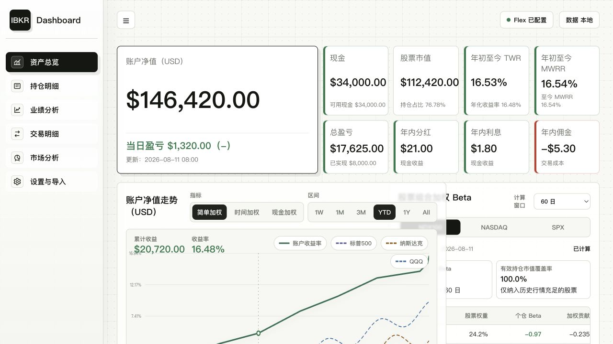
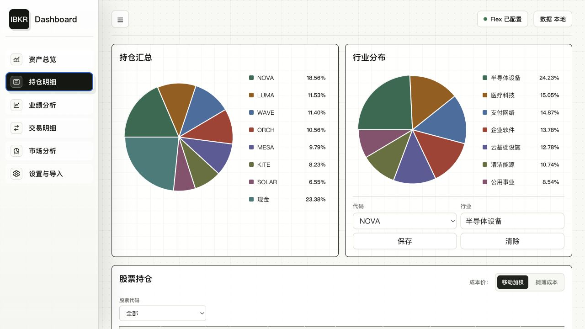
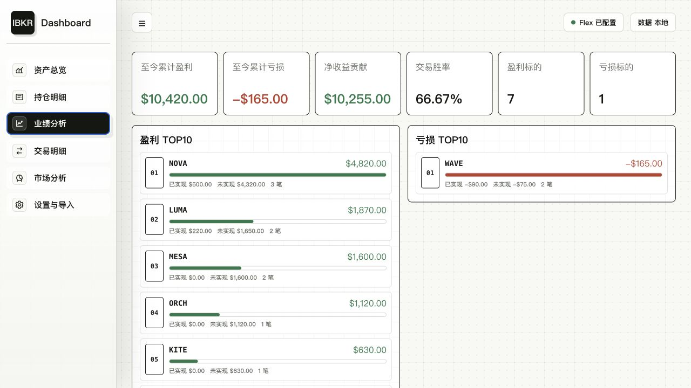
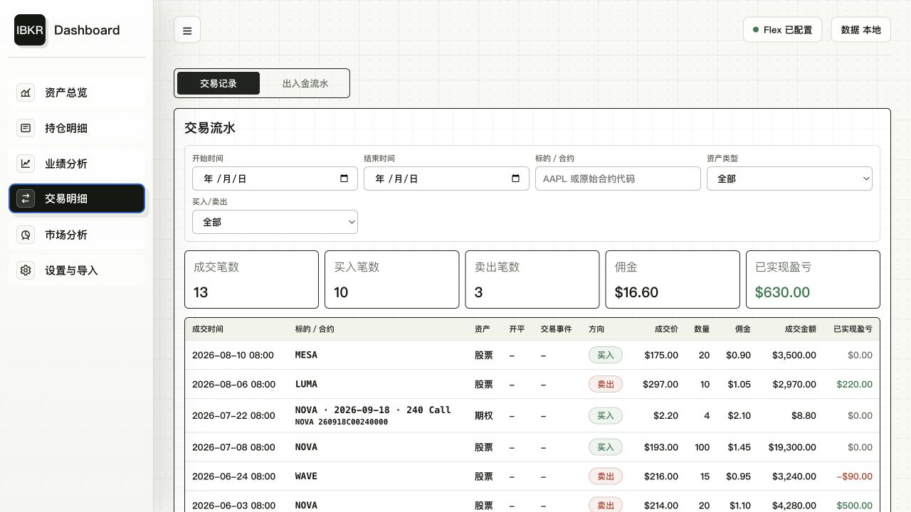
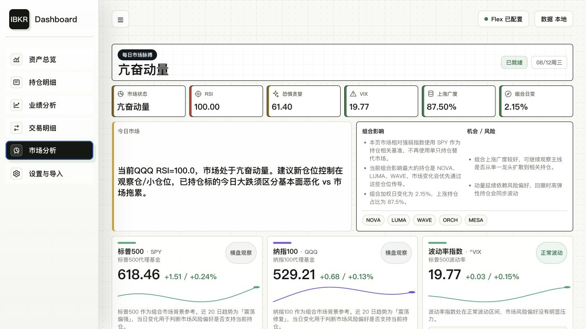
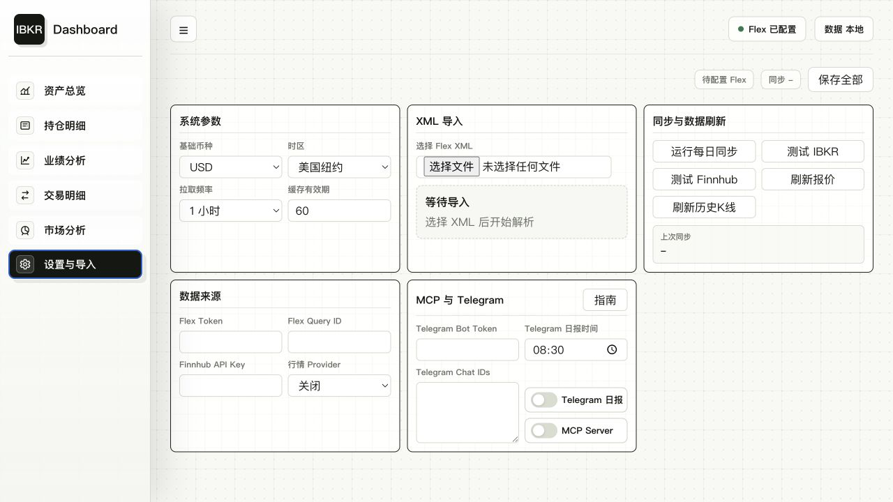

<a id="english-version"></a>

# IBKR Dashboard

[中文版本](#chinese-version)

IBKR Dashboard is a locally hosted investment analytics dashboard for Interactive Brokers. It reads Interactive Brokers Flex XML files and visualizes assets, positions, performance, trades, deposits and withdrawals, and portfolio risk.

This project is strictly read-only. It does not support trading, placing, canceling, or modifying orders, unlocking trading, or executing risk controls. Real account data, XML files, and API keys should remain on your local machine.

## Showcase

Every preview below is captured from the current local build with synthetic mock data. No real account identifiers, positions, transactions, credentials, or imported files are included. Click a preview to open it at full size.

以下预览来自当前本地构建，仅使用合成 mock 数据，不包含真实账户标识、持仓、交易、凭据或导入文件。点击图片可查看原图。

<table>
  <tr>
    <td width="50%" align="center">
      <a href="promo-assets/showcase-overview.png"></a><br />
      <sub>Asset overview / 资产总览</sub>
    </td>
    <td width="50%" align="center">
      <a href="promo-assets/showcase-positions.png"></a><br />
      <sub>Positions / 持仓明细</sub>
    </td>
  </tr>
  <tr>
    <td width="50%" align="center">
      <a href="promo-assets/showcase-performance.png"></a><br />
      <sub>Performance analysis / 业绩分析</sub>
    </td>
    <td width="50%" align="center">
      <a href="promo-assets/showcase-trades.png"></a><br />
      <sub>Transactions / 交易明细</sub>
    </td>
  </tr>
  <tr>
    <td width="50%" align="center">
      <a href="promo-assets/showcase-market.png"></a><br />
      <sub>Market analysis / 市场分析</sub>
    </td>
    <td width="50%" align="center">
      <a href="promo-assets/showcase-settings.png"></a><br />
      <sub>Settings and import / 设置与导入</sub>
    </td>
  </tr>
</table>

## Who It Is For

- IBKR account holders who can export Flex XML files.
- Investors who want to organize their portfolios locally without uploading real trading data to third-party websites.
- Individual investors who want a unified view of asset curves, portfolio structure, trading performance, and portfolio risk.
- Users who prefer a one-command Docker setup instead of configuring Python, Node.js, and Elasticsearch separately.

## Features

### Asset Overview

- Shows total assets, cash, market value of positions, year-to-date commissions, returns, and risk alerts.
- Supports multiple time ranges for the net asset value curve: 1 week, month to date, 1 month, 3 months, year to date, 1 year, all time, and custom ranges.
- Supports simple-weighted, time-weighted, and money-weighted return calculations.
- Compares performance against benchmarks such as the S&P 500, Nasdaq, and QQQ.
- Marks deposits, withdrawals, and other cash-flow events on the net asset value curve to help explain sudden changes.

### Positions

- Shows a position summary, sector allocation, detailed positions, and profit and loss.
- Supports custom sector mappings for classifying ETFs, ADRs, and special instruments.
- Supports switching between moving-average and diluted cost bases.
- Opens an individual candlestick chart when you select a symbol in the positions table.
- Marks buy and sell transactions on candlestick charts for easier trade review.

### Performance Analysis

- Shows the top 10 gains, top 10 losses, cumulative gains, cumulative losses, and trade win rate.
- Includes a profit-and-loss calendar for identifying the dates that contributed most to returns or drawdowns.
- Includes monthly trading statistics for the past year to help identify changes in trading frequency and results.

### Transactions

- Supports querying and paginating trades by time, symbol, side, and currency.
- Supports querying deposits and withdrawals to reconcile cash flows with account value changes.
- Preserves the original IBKR Flex XML accounting conventions for traceability.

### Market Analysis

- Provides a market analysis view.
- Market analysis covers market conditions, strength indicators, portfolio impact, opportunities, and risks related to current positions.
- When external data is unavailable, the page explicitly reports missing or unavailable data instead of inventing values.

### Settings and Import

- Supports base currency, timezone, real-time price priority, polling frequency, and other basic settings.
- Imports Flex XML files.
- Supports IBKR Flex online synchronization.
- Supports read-only market data from Finnhub, Longbridge, Yahoo Finance, and Futu OpenD.
- Supports read-only Telegram commands and scheduled daily reports.
- Provides an MCP stdio server that lets supported desktop clients read local analysis results.

## Technology Stack

- Frontend: React 18, TypeScript, Vite, and ECharts.
- Backend: Python 3.12+, FastAPI, APScheduler, and httpx.
- Storage: Elasticsearch, with in-memory storage available for tests and temporary development.
- Containers: Docker Compose starts Elasticsearch, the backend API, and the frontend with one command.
- Data sources: IBKR Flex XML, IBKR Flex Web Service, Longbridge, Finnhub, Yahoo Finance, and Futu OpenD (read-only).

Regular use does not require installing Python, Node.js, or Elasticsearch separately. Docker prepares these environments when the application starts.

## Quick Start

### 1. Install Docker Desktop

Download and install Docker Desktop:

- macOS / Windows: [https://www.docker.com/products/docker-desktop/](https://www.docker.com/products/docker-desktop/)

Open Docker Desktop after installation and wait until it is running before continuing.

### 2. Download the Project

If Git is installed, run:

```bash
git clone <this GitHub repository URL>
cd ibkr-dashboard
```

If Git is not installed, click the following on the GitHub repository page:

```text
Code -> Download ZIP
```

Extract the archive, then open a terminal in the extracted project directory.

On macOS, open the project folder in Finder, right-click it, and choose **Services -> New Terminal at Folder**. If that menu is unavailable, open Terminal, type `cd `, drag the project folder into the terminal window, and press Enter.

### 3. Start the Application

Run this command in the project directory:

```bash
docker compose up --build
```

The first startup downloads base images and dependencies and usually takes a few minutes. Continuous terminal output is normal; keep the terminal window open.

When startup completes, open:

```text
http://localhost:5176
```

For subsequent startups, run this command in the project directory:

```bash
docker compose up
```

## Stop the Application

If the application was started with `docker compose up`, press the following in the same terminal:

```text
Ctrl + C
```

To run it in the background, use:

```bash
docker compose up -d
```

To stop the background services, use:

```bash
docker compose down
```

`docker compose down` does not delete imported data or settings. Only the following command clears the local database; use it with caution:

```bash
docker compose down -v
```

## Local Development

For continued development, use local development mode. A single command from the project root starts both the backend and frontend.

### Prerequisites

1. Install Python 3.12+.
2. Install Node.js 20+.
3. Ensure Elasticsearch is available locally at `http://127.0.0.1:9200` by default.

### Start with One Command

Run from the project root:

```bash
npm run dev:all
```

The script automatically:

- Creates a `.venv` virtual environment and installs backend dependencies on first run.
- Installs frontend dependencies on first run.
- Starts the backend at `http://127.0.0.1:8085`.
- Starts the frontend at `http://127.0.0.1:5176`.

To stop both processes, press `Ctrl + C` in the current terminal.

### Optional Environment Variables

Override the default ports and Elasticsearch address when starting the application:

```bash
BACKEND_PORT=8086 FRONTEND_PORT=5177 ES_HOST=http://127.0.0.1:9200 npm run dev:all
```

For temporary development or testing without persistent Elasticsearch storage, use the in-memory backend:

```bash
ES_BACKEND=in_memory npm run dev:all
```

### Common Verification Commands

Build the frontend:

```bash
npm --prefix frontend run build
```

Run backend tests:

```bash
cd backend
ES_BACKEND=in_memory pytest -q tests/
```

## First-Time Setup

1. Open `http://localhost:5176`.
2. Go to **Settings and Import**.
3. Set the base currency to `USD`, `HKD`, or `CNY`. The base currency primarily affects the Asset Overview page; the Positions, Transactions, and Performance pages preserve the account and XML currencies to avoid confusing cross-page conversions.
4. Set a timezone, such as Beijing or New York.
5. Optionally enter a Finnhub API key. The application works without one, but some real-time quotes and historical data may be limited.
6. To use IBKR Flex online synchronization, enter the Flex Token and Query ID.
7. If you already have a Flex XML file, select and import it in the XML import section.
8. After the import succeeds, review the data under **Asset Overview**, **Positions**, **Performance Analysis**, **Transactions**, and **Market Analysis**.

## Get an IBKR Flex XML File

1. Sign in to the IBKR website and go to:

```text
Performance & Reports -> Flex Queries -> Activity Flex Query
```

2. If you do not have an Activity Flex Query template, click the `+` button on the right to create one.

3. On the `Sections (Select Multiple)` page, select every section needed for analysis. Expand each section and select its child fields, using `Select All` where appropriate. The output format must be `XML`.

4. Configure General Configuration. Cover the full historical period and include complete trade, cash-flow, position, and account-value fields. Missing fields result in incomplete asset, position, transaction, or deposit and withdrawal data.

5. After saving the template, IBKR generates a Query ID. Open the Flex Web Service page, enable Flex Web Service Status, and use the Current Token shown in the middle of the page as the Flex Token.

6. Run the query on the IBKR website and download the XML file, or enter the Query ID and Token under **Settings and Import** for online synchronization.

For long account histories, export XML files by calendar year. Keep the XML files on your computer and import them into this application.

## Configuration

### Basic Settings and Synchronization

- The base currency controls the Asset Overview display.
- The timezone controls the display of trade dates, cash-flow dates, and scheduled tasks.
- Real-time price priority attempts to refresh displayed prices from external market data and falls back to imported data when external sources are unavailable.
- The IBKR Flex Token and Query ID enable online synchronization. Without them, you can still use XML file imports.

### Market Data Providers

Longbridge is the recommended primary provider. It reads quotes and daily candlesticks and provides no trading capability.

Go to **Settings and Import**, switch the market data provider to **Longbridge**, and save. You can then test the Longbridge connection:

```bash
curl -X POST http://127.0.0.1:8085/api/settings/data-sources/longbridge/test \
  -H 'Content-Type: application/json' \
  -d '{"symbol":"AAPL","days":5}'
```

You can also manually refresh historical candlesticks for positions and major market indexes. Results are stored in the local persistent cache at `~/.cache/ibkr-dashboard/market-history.json`:

```bash
curl -X POST http://127.0.0.1:8085/api/settings/data-sources/history/refresh \
  -H 'Content-Type: application/json' \
  -d '{"days":365}'
```

To refresh only selected symbols:

```bash
curl -X POST http://127.0.0.1:8085/api/settings/data-sources/history/refresh \
  -H 'Content-Type: application/json' \
  -d '{"symbols":["AAPL","QQQ","^IXIC"],"days":365}'
```

If Longbridge is unavailable, historical market data falls back to Finnhub, Yahoo Finance, and Nasdaq in that order.

If Futu OpenD is already running locally, switch the market data provider to **Local OpenD** and enter its host and port. The default host is `127.0.0.1`, and the default port is `11111`.

After saving, test OpenD with:

```bash
curl -X POST http://127.0.0.1:8085/api/settings/data-sources/futu/test \
  -H 'Content-Type: application/json' \
  -d '{"symbol":"AAPL"}'
```

These market data integrations only read snapshot quotes and daily candlesticks. The project contains no APIs for trading, placing or canceling orders, or unlocking trading.

### Telegram

Telegram settings include a Bot Token, allowlisted Chat IDs, a daily report switch, and a daily report time. Separate multiple Chat IDs with commas, spaces, or line breaks.

Setup:

1. Find `@BotFather` on Telegram, create a bot, and save the Bot Token.
2. Send your bot a message such as `/start`.
3. Query the chat ID with the Bot API:

```bash
curl "https://api.telegram.org/bot<TELEGRAM_BOT_TOKEN>/getUpdates"
```

4. Add the returned `message.chat.id` to the Chat ID allowlist. Group and channel IDs are usually negative.
5. Save the Bot Token, allowlist, and daily report time. Click **Save All**, then enable **Telegram Daily Report** only when automatic reports are needed.

The backend provides a read-only command dry-run endpoint for checking command responses and allowlist rules:

```bash
curl -X POST http://127.0.0.1:8085/api/telegram/commands/dry-run \
  -H 'Content-Type: application/json' \
  -d '{"chat_id":"123456789","text":"/risk"}'
```

Supported read-only commands:

```text
/overview
/summary
/positions
/risk
/cashflow
/cash
/market
/report
```

`/summary` is an alias for `/overview`, and `/cash` is an alias for `/cashflow`. These commands use local account and market data only. None requires an AI provider.

Daily report scheduling is disabled by default. When enabled, the backend sends the `/report` output to all allowlisted Chat IDs at the configured time. Before deploying a real bot, use the dry-run endpoint to preview the report and recipient count:

```bash
curl -X POST http://127.0.0.1:8085/api/telegram/reports/dry-run
```

### MCP

The MCP server is a stdio process that exposes local, read-only dashboard data to supported desktop clients. It can read positions, risk summaries, market analysis, performance, cash flows, and option snapshots. It does not run an AI provider and cannot place, modify, or cancel trades.

Before configuring a client:

1. Start local Elasticsearch and the dashboard, then import at least one Flex XML file.
2. The examples below use the project-root `.venv` created by `npm run dev:all`. In **Settings and Import**, enable **MCP Server** and click **Save All** to record the local preference. Your client still starts the stdio process itself.
3. Replace every placeholder with the absolute path of this checkout. The MCP process reads Elasticsearch directly. It does not connect through the web UI on port `5176` or the API on port `8085`.
4. After saving the client configuration, restart or reconnect the client.

The Claude Desktop configuration file on macOS is usually located at:

```text
~/Library/Application Support/Claude/claude_desktop_config.json
```

Example configuration:

```json
{
  "mcpServers": {
    "ibkr-dashboard": {
      "command": "/absolute/path/ibkr-dashboard/.venv/bin/python",
      "args": ["-m", "app.mcp_server"],
      "cwd": "/absolute/path/ibkr-dashboard/backend",
      "env": {
        "ES_BACKEND": "http",
        "ES_HOST": "http://127.0.0.1:9200"
      }
    }
  }
}
```

For Codex Desktop or Codex CLI with TOML configuration, add the following to `~/.codex/config.toml`:

```toml
[mcp_servers.ibkr-dashboard]
command = "/absolute/path/ibkr-dashboard/.venv/bin/python"
args = ["-m", "app.mcp_server"]
cwd = "/absolute/path/ibkr-dashboard/backend"

[mcp_servers.ibkr-dashboard.env]
ES_BACKEND = "http"
ES_HOST = "http://127.0.0.1:9200"
```

Validate the same setup before connecting a client:

```bash
cd /absolute/path/ibkr-dashboard/backend
ES_BACKEND=http ES_HOST=http://127.0.0.1:9200 ../.venv/bin/python -m app.mcp_server --list-tools
```

The command lists `get_account_overview`, `list_positions`, `get_position_detail`, `get_portfolio_risk`, `get_market_regime`, `get_stock_analysis`, `get_performance_summary`, `list_cash_flows`, and `get_wheel_snapshot`. Use `symbol` for a single position or stock query, and `limit` where a list tool accepts it.

If the client cannot connect, check the absolute `command` and `cwd`, then verify `ES_HOST` points to the local Elasticsearch service. If tools connect but return missing data, import a Flex XML file or run the daily sync before reconnecting the client.

## Data and Privacy

- Real XML files are not uploaded to third-party services.
- Application data is stored in the local Docker volume `es_data` by default.
- Deleting containers does not delete data; deleting the Docker volume does.
- Credentials such as the IBKR Flex Token, Finnhub API key, and Telegram Bot Token should only be stored in local settings.
- Do not commit real XML, CSV, Excel, `.env`, API key, Flex Token, or Telegram Bot Token files or values to the repository.
- External market data providers are only used to read market data and cannot trigger account trades.

## FAQ

### I Cannot Open http://localhost:5176

Make sure Docker Desktop is running, then run this command again in the project directory:

```bash
docker compose up --build
```

If the port is already in use, stop the old services first:

```bash
docker compose down
```

Then start the application again.

### The First Startup Is Slow

This is expected. The first startup downloads the Python, Node.js, Elasticsearch, and other runtime environments. Subsequent startups are faster.

### No Data Appears After Importing XML

Confirm that the imported file is an IBKR Flex XML file rather than a PDF, CSV, or standard activity statement. You can also export another Flex Query that includes positions, trades, cash flows, and account value.

### Why Did Other Pages Not Change After I Set the Base Currency?

To avoid inconsistent cross-page currency conversions, the base currency primarily affects Asset Overview. The Positions, Transactions, and Performance pages preserve the original account and XML currencies.

### Can I Still Use the Dashboard When Market Data Is Unavailable?

Yes. Asset, position, performance, and transaction analysis primarily use local Flex XML data. When external market data is unavailable, the page reports missing or unavailable data or uses local rule-based results.

## Current Limitations

- Long-term historical prices, benchmark history, and external market data depend on public data-source availability and rate limits.
- External quotes and market sentiment indicators in Market Analysis depend on their respective providers.
- Telegram daily reports require a valid Bot Token, network connectivity, and a supported runtime environment.
- MCP tools are read-only and do not support, and are not planned to support, trading actions.

---

<a id="chinese-version"></a>

# IBKR Dashboard

[English](#english-version)

IBKR Dashboard 是一个本地运行的 IBKR 投资分析看板。它读取 Interactive Brokers Flex XML，对资产、持仓、业绩、交易记录、出入金记录和组合风险做可视化分析。

本项目只做只读分析，不提供交易、下单、撤单、改单、解锁交易或风控执行能力。真实账户数据、XML 文件和 API Key 都应保留在本机环境中。

## 适合谁使用

- 有 IBKR 账户，并且可以导出 Flex XML 的用户。
- 想在自己电脑上整理投资组合，不想把真实交易数据上传到第三方网站的用户。
- 希望同时查看资产曲线、持仓结构、交易业绩和组合风险的个人投资者。
- 不想单独配置 Python、Node.js、Elasticsearch，也可以通过 Docker 一键运行的用户。

## 功能概览

### 资产总览

- 展示总资产、现金、持仓市值、年内佣金、收益率和风险提示。
- 净值曲线支持不同时间范围：1 周、本月至今、1 个月、3 个月、本年至今、1 年、全部和自定义区间。
- 收益计算支持简单加权、时间加权、现金加权等口径。
- 可与标普 500、纳斯达克、QQQ 等基准曲线对比。
- 净值曲线上会标注入金、出金等现金流事件，方便解释曲线跳变。

### 持仓明细

- 展示持仓汇总、行业分布、持仓明细表和盈亏情况。
- 支持自定义行业映射，适合把 ETF、ADR 或特殊标的归入自己的分类体系。
- 成本口径支持移动加权和摊薄成本切换。
- 点击持仓明细表中的标的，可以查看个股 K 线。
- K 线上会标注买入、卖出等操作记录，方便复盘交易位置。

### 业绩分析

- 展示盈利 TOP10、亏损 TOP10、累计盈利、累计亏损和交易胜率。
- 支持盈亏日历，快速查看哪些日期贡献了主要收益或回撤。
- 支持近一年月度交易统计，帮助识别交易频率和结果变化。

### 交易明细

- 支持交易记录查询，按时间、代码、方向、币种筛选和分页。
- 支持出入金记录查询，帮助核对现金流和账户净值变化。
- 交易记录和现金流水保持 IBKR Flex XML 的原始口径，便于追溯。

### 市场分析

- 展示市场状态、强弱指标、组合影响、机会和风险。
- 风险图表用于观察市场指标与当前持仓的关联。
- 外部数据不可用时，页面会明确显示缺失或不可用，不会编造数值。

### 设置与导入

- 支持基础币种、时区、实时价格优先、拉取频率等基础设置。
- 支持 Flex XML 文件导入。
- 支持 IBKR Flex 在线同步配置。
- 支持 Finnhub、长桥、Yahoo Finance、Futu OpenD 等只读行情来源。
- 支持 Telegram 只读命令和日报推送。
- 提供 MCP stdio server，可接入支持的桌面客户端读取本地分析结果。

## 技术栈

- 前端：React 18、TypeScript、Vite、ECharts。
- 后端：Python 3.12+、FastAPI、APScheduler、httpx。
- 存储：Elasticsearch；测试和临时开发可使用内存存储。
- 容器化：Docker Compose 一键启动 Elasticsearch、后端 API 和前端。
- 数据来源：IBKR Flex XML、IBKR Flex Web Service、长桥、Finnhub、Yahoo Finance、Futu OpenD（只读）。

普通使用不需要单独安装 Python、Node.js 或 Elasticsearch；Docker 会在启动时自动准备这些环境。

## 快速启动

### 1. 安装 Docker Desktop

下载并安装 Docker Desktop：

- macOS / Windows: [https://www.docker.com/products/docker-desktop/](https://www.docker.com/products/docker-desktop/)

安装完成后，打开 Docker Desktop。等它显示正在运行后，再继续下面的步骤。

### 2. 下载项目

如果已经安装 Git，可以在终端运行：

```bash
git clone <这个 GitHub 仓库地址>
cd ibkr-dashboard
```

如果没有安装 Git，也可以在 GitHub 页面点击：

```text
Code -> Download ZIP
```

下载后解压，然后在终端进入解压出来的项目文件夹。

macOS 用户可以在 Finder 中打开项目文件夹，右键选择“服务 -> 新建位于文件夹位置的终端窗口”。如果没有这个菜单，也可以打开“终端”，输入 `cd `，把项目文件夹拖进终端，再按回车。

### 3. 启动应用

在项目文件夹里运行：

```bash
docker compose up --build
```

第一次启动会下载基础镜像和依赖，通常需要几分钟。看到终端里持续输出日志是正常的，不要关闭这个终端窗口。

启动完成后，打开浏览器访问：

```text
http://localhost:5176
```

以后再次启动，仍然在项目文件夹里运行：

```bash
docker compose up
```

## 停止应用

如果是用 `docker compose up` 启动的，在同一个终端窗口按：

```text
Ctrl + C
```

如果想让它在后台运行，可以用：

```bash
docker compose up -d
```

后台运行时，停止命令是：

```bash
docker compose down
```

`docker compose down` 不会删除已经导入的数据和设置。只有运行下面这个命令才会清空本地数据库，请谨慎使用：

```bash
docker compose down -v
```

## 本机开发

如果要继续开发，推荐使用本机开发模式。项目根目录支持一条命令同时启动后端和前端。

### 开发环境准备

1. 安装 Python 3.12+。
2. 安装 Node.js 20+。
3. 确保本机可用 Elasticsearch，默认读取 `http://127.0.0.1:9200`。

### 一条命令启动

在项目根目录运行：

```bash
npm run dev:all
```

脚本会自动处理以下事项：

- 首次创建 `.venv` 虚拟环境并安装后端依赖。
- 首次安装前端依赖。
- 启动后端 `http://127.0.0.1:8085`。
- 启动前端 `http://127.0.0.1:5176`。

停止方式：在当前终端按 `Ctrl + C`，脚本会同时停止前后端进程。

### 可选环境变量

可以在启动前临时覆盖默认端口和 ES 地址：

```bash
BACKEND_PORT=8086 FRONTEND_PORT=5177 ES_HOST=http://127.0.0.1:9200 npm run dev:all
```

如果只是临时开发或跑测试，不想连接持久化 Elasticsearch，可以使用内存存储：

```bash
ES_BACKEND=in_memory npm run dev:all
```

### 常用验证命令

前端构建：

```bash
npm --prefix frontend run build
```

后端测试：

```bash
cd backend
ES_BACKEND=in_memory pytest -q tests/
```

## 第一次使用

1. 打开 `http://localhost:5176`。
2. 进入“设置与导入”。
3. 设置基础币种：`USD`、`HKD` 或 `CNY`。基础币种主要用于资产总览；持仓、交易、业绩等页面保留账户和 XML 的原始计价口径，避免跨页面换算造成混淆。
4. 设置时区，例如中国北京或美国纽约。
5. 按需填写 Finnhub API Key。没有 Key 也可以先使用，部分实时行情和历史数据可能会受限。
6. 如果要使用 IBKR Flex 在线同步，填写 Flex Token 和 Query ID。
7. 如果已经有 Flex XML 文件，直接在 XML 导入模块选择文件并导入。
8. 导入成功后，进入“资产总览”“持仓明细”“业绩分析”“交易明细”“市场分析”查看数据。

## 获取 IBKR Flex XML

1. 登录 IBKR 网页端，进入：

```text
Performance & Reports -> Flex Queries -> Activity Flex Query
```

2. 如果还没有 Activity Flex Query 模板，点击右侧的 `+` 按钮新建一个。

3. 在 `Sections (Select Multiple)` 页面中，建议把需要分析的 Section 都勾选。点击任意 Section 展开后，里面的子字段也需要勾选，可以使用页面里的 `Select All`。输出格式必须选择 `XML`。

4. 配置 General Configuration。建议覆盖完整历史区间，并确保交易、现金流水、持仓、账户净值等字段完整。字段缺失会导致资产、持仓、交易或出入金数据不完整。

5. 保存模板后，IBKR 会生成一个 Query ID。进入 Flex Web Service 页面，启用 Flex Web Service Status，页面中间的 Current Token 就是 Flex Token。

6. 可以在 IBKR 页面直接运行查询并下载 XML 文件，也可以把 Query ID 和 Token 填入“设置与导入”中进行在线同步。

对于年份较多的历史文件，建议按照自然年来导出 XML 文件。XML 文件保存在自己的电脑上，然后通过本项目导入。

## 配置说明

### 基础设置和同步

- 基础币种用于资产总览展示。
- 时区用于交易日期、现金流日期和定时任务展示。
- 实时价格优先会尽量使用外部行情刷新展示价，外部行情不可用时回退到导入数据。
- IBKR Flex Token 和 Query ID 用于在线同步；如果不配置，也可以只通过 XML 文件导入使用。

### 行情源

推荐优先使用长桥 provider。它用于读取报价和日 K 线，不提供交易能力。

进入“设置与导入”，把行情 Provider 切换为“长桥”并保存。保存后可以测试长桥连通性：

```bash
curl -X POST http://127.0.0.1:8085/api/settings/data-sources/longbridge/test \
  -H 'Content-Type: application/json' \
  -d '{"symbol":"AAPL","days":5}'
```

也可以手动重拉持仓和核心市场指数的历史 K 线，结果会写入本地持久化缓存 `~/.cache/ibkr-dashboard/market-history.json`：

```bash
curl -X POST http://127.0.0.1:8085/api/settings/data-sources/history/refresh \
  -H 'Content-Type: application/json' \
  -d '{"days":365}'
```

如果只想刷新指定标的：

```bash
curl -X POST http://127.0.0.1:8085/api/settings/data-sources/history/refresh \
  -H 'Content-Type: application/json' \
  -d '{"symbols":["AAPL","QQQ","^IXIC"],"days":365}'
```

长桥不可用时，历史行情仍会按 Finnhub、Yahoo Finance、Nasdaq 的顺序兜底。

如果本机已经运行 Futu OpenD，也可以把行情 Provider 切换为“本地 OpenD”，并填写 host 和 port。默认 host 是 `127.0.0.1`，默认 port 是 `11111`。

保存设置后可以测试 OpenD：

```bash
curl -X POST http://127.0.0.1:8085/api/settings/data-sources/futu/test \
  -H 'Content-Type: application/json' \
  -d '{"symbol":"AAPL"}'
```

这些行情集成都只读取快照报价和日 K 线。项目代码不包含交易、下单、撤单或解锁交易接口。

### Telegram

Telegram 配置包含 Bot Token、白名单 Chat ID、日报开关和日报时间。多个 Chat ID 可以用逗号、空格或换行分隔。

接入步骤：

1. 在 Telegram 找 `@BotFather` 创建 bot，保存 Bot Token。
2. 给你的 bot 发一条消息，例如 `/start`。
3. 用 Bot API 查询 chat id：

```bash
curl "https://api.telegram.org/bot<TELEGRAM_BOT_TOKEN>/getUpdates"
```

4. 把返回里的 `message.chat.id` 填入白名单 Chat ID。群组或频道一般是负数 ID。
5. 保存 Bot Token、白名单、日报时间，点击“保存全部”；需要自动日报时再打开“Telegram 日报”。

当前后端提供只读命令 dry-run 接口，方便先验证命令返回内容和白名单规则：

```bash
curl -X POST http://127.0.0.1:8085/api/telegram/commands/dry-run \
  -H 'Content-Type: application/json' \
  -d '{"chat_id":"123456789","text":"/risk"}'
```

支持的只读命令包括：

```text
/overview
/summary
/positions
/risk
/cashflow
/cash
/market
/report
```

`/summary` 是 `/overview` 的别名，`/cash` 是 `/cashflow` 的别名。这些命令只使用本地账户和行情数据，不需要 AI provider。

日报调度默认关闭。开启后，后端会按设置中的日报时间把 `/report` 内容发送给所有白名单 Chat ID。部署真实 Bot 前，可以先用 dry-run 查看日报内容和发送人数：

```bash
curl -X POST http://127.0.0.1:8085/api/telegram/reports/dry-run
```

### MCP

MCP server 是 stdio 进程，把本地看板的只读数据暴露给支持的桌面客户端。它可以读取持仓、风险摘要、市场分析、业绩、现金流和期权快照，不运行 AI provider，也不提供下单、改仓或撤单能力。

接入客户端前：

1. 启动本地 Elasticsearch 和看板，并完成至少一次 Flex XML 导入。
2. 下方示例使用 `npm run dev:all` 在项目根目录创建的 `.venv`。在“设置与导入”中打开“MCP Server”并点击“保存全部”，用于记录本地接入偏好；客户端仍会自行启动 stdio 进程。
3. 将示例中的占位路径替换为当前项目的绝对路径。MCP 进程直接读取 Elasticsearch，不经过 `5176` 端口的网页或 `8085` 端口的 API。
4. 保存客户端配置后，重启或重新连接客户端。

Claude Desktop 的 macOS 配置文件通常在：

```text
~/Library/Application Support/Claude/claude_desktop_config.json
```

示例配置：

```json
{
  "mcpServers": {
    "ibkr-dashboard": {
      "command": "/绝对路径/ibkr-dashboard/.venv/bin/python",
      "args": ["-m", "app.mcp_server"],
      "cwd": "/绝对路径/ibkr-dashboard/backend",
      "env": {
        "ES_BACKEND": "http",
        "ES_HOST": "http://127.0.0.1:9200"
      }
    }
  }
}
```

Codex Desktop / Codex CLI 使用 TOML 配置时，可以在 `~/.codex/config.toml` 加入：

```toml
[mcp_servers.ibkr-dashboard]
command = "/绝对路径/ibkr-dashboard/.venv/bin/python"
args = ["-m", "app.mcp_server"]
cwd = "/绝对路径/ibkr-dashboard/backend"

[mcp_servers.ibkr-dashboard.env]
ES_BACKEND = "http"
ES_HOST = "http://127.0.0.1:9200"
```

连接客户端前，先验证同一套配置：

```bash
cd /绝对路径/ibkr-dashboard/backend
ES_BACKEND=http ES_HOST=http://127.0.0.1:9200 ../.venv/bin/python -m app.mcp_server --list-tools
```

成功后会列出 `get_account_overview`、`list_positions`、`get_position_detail`、`get_portfolio_risk`、`get_market_regime`、`get_stock_analysis`、`get_performance_summary`、`list_cash_flows` 和 `get_wheel_snapshot`。查询单个持仓或个股时传入 `symbol`，支持列表限制的工具可传入 `limit`。

如果客户端连不上，先核对 `command`、`cwd` 是否为绝对路径，再确认 `ES_HOST` 指向本地 Elasticsearch。工具能连上但返回缺数据时，先导入 Flex XML 或运行每日同步，再重新连接客户端。

## 数据和隐私

- 真实 XML 文件不会被上传到第三方服务。
- 应用数据默认保存在 Docker 的本地卷 `es_data` 中。
- 删除容器不会删除数据；删除 Docker 卷才会清空数据。
- IBKR Flex Token、Finnhub API Key、Telegram Bot Token 等凭据只应保存在本地设置中。
- 不要把真实 XML、CSV、Excel、`.env`、API Key、Flex Token 或 Telegram Bot Token 提交到仓库。
- 外部行情只用于读取市场数据，不会触发账户交易。

## 常见问题

### 打不开 http://localhost:5176

先确认 Docker Desktop 正在运行，然后在项目文件夹重新执行：

```bash
docker compose up --build
```

如果提示端口被占用，先停止旧服务：

```bash
docker compose down
```

然后再启动。

### 第一次启动很慢

正常。第一次会下载 Python、Node.js、Elasticsearch 等运行环境。后续启动会快很多。

### 导入 XML 后没有数据

确认导入的是 IBKR Flex XML，而不是 PDF、CSV 或普通活动报表。也可以重新导出一个包含持仓、交易、现金流水和账户净值的 Flex Query。

### 设置基础币种后，为什么其他页面没变

为了避免跨页面币种换算造成口径不一致，基础币种主要影响资产总览；持仓、交易、业绩等页面保留账户和 XML 的原始计价口径。

### 行情不可用时页面还能用吗

可以。资产、持仓、业绩和交易分析主要来自本地 Flex XML。外部行情不可用时，页面会明确显示缺失或不可用。

## 当前限制

- 长期历史行情、基准历史数据和外部行情接口依赖公开数据源可用性和频率限制。
- 市场分析中的外部行情和市场情绪指标依赖对应 provider 的可用性。
- Telegram 日报需要真实 Bot Token、网络连通性和运行环境支持。
- MCP 工具只读，不支持也不计划支持交易动作。
